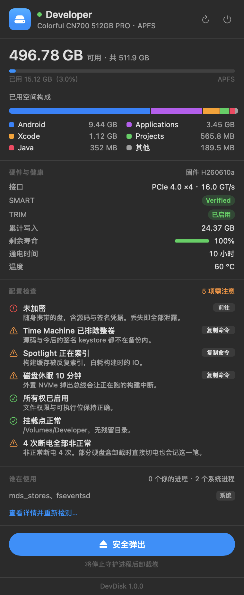
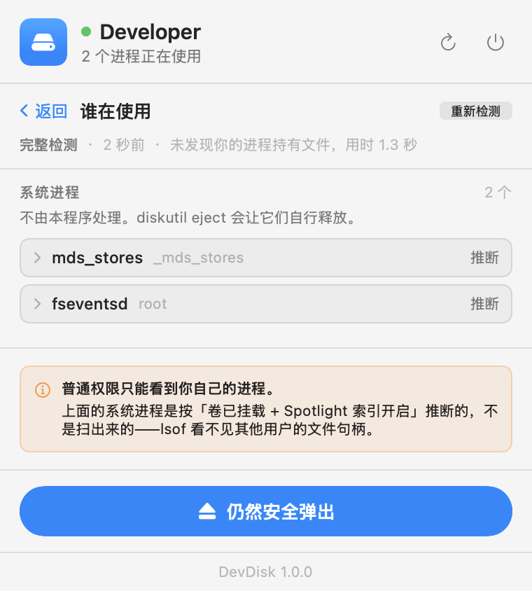

<div align="center">


# DevDisk

一个常驻菜单栏的 macOS 小工具，用来看清一块外置开发盘的状态，并按正确顺序安全弹出它。

</div>

<div align="center">

&nbsp;&nbsp;

</div>

---

## 为什么

一块每天插拔的外置开发盘，上面是 Android SDK、gradle 缓存、AVD、JDK、Xcode DerivedData 和源码。它带来两个每天都要面对的麻烦：

**拔盘前的检查是手工活。** Gradle daemon、Kotlin compile daemon、adb、emulator、Android Studio、Xcode 都会长期持有盘上的文件句柄。直接推出会截断 gradle 缓存写入，事后表现为莫名其妙的构建失败——而且不会立刻报错，你会以为是代码问题。走 PCIe 隧道的 NVMe 硬盘盒还有个额外风险：macOS 把它认作 `RemovableMedia: false`，**不会给出 U 盘那种"未正确推出"的强提示**。

**盘的状态散落在七八个命令里。** 容量、加密、SMART、TRIM、链路速率、Spotlight 索引、Time Machine 排除、磁盘休眠——想知道现状得把 `diskutil` / `system_profiler` / `mdutil` / `tmutil` / `pmset` 的输出一路拼起来。

## 安装

从 [Releases](https://github.com/fengfe1125/devdisk/releases) 下载最新的 zip，解压后把 `DevDisk.app` 拖进 `/Applications`。

**首次打开必须右键 → 打开。** 这个应用只做了 ad-hoc 签名、未经 Apple 公证（那需要 Apple Developer Program，$99/年），双击会被 Gatekeeper 拦下并提示"无法验证开发者"。右键 → 打开之后就正常了，后续启动不再提示。

或者自己构建：

```bash
git clone https://github.com/fengfe1125/devdisk.git
cd devdisk && ./package.sh /Applications
```

**可选依赖**：`brew install smartmontools`，用于读取累计写入量、剩余寿命、通电时间、温度、非正常断电次数。**不需要 root**。没装也能运行，健康区会显示缺失原因而不是留白。

其余全部使用系统自带命令：`diskutil` / `system_profiler` / `mdutil` / `tmutil` / `pmset` / `lsof` / `ps`。

## 用法

**自动识别外置盘。** 打开就显示当前接着的那块，不用先去配置路径。点头部的盘名可以切换到别的盘。你可以把某块盘「设为默认」——它一插上就自动切回它，没插时则显示当前接着的那块。

挂载的磁盘映像（下载来的 `.dmg`）和启动盘不会出现在列表里。**这个过滤是必需的**：一个挂载的 DMG 在 `diskutil` 眼里 `RemovableMediaOrExternalDevice` 同样是 `true`，不排掉的话 Downloads 里每个安装包都会被当成硬盘列出来，靠 `BusProtocol == "Disk Image"` 区分。

菜单栏出现一个硬盘图标，程序坞里也有。菜单栏点开是紧凑卡片，需要看全时点卡片右上角的窗口按钮切到可缩放的独立窗口。

图标为实心机身 + 图形挖空的模板图，随状态变化：

| 挖空图形 | 状态 |
|:---:|---|
| ▲ 弹出三角 | 已连接，配置检查全过 |
| ! 感叹号 | 已连接，有配置项需注意 |
| — 减号 | 正在弹出 |
| ✓ 对勾 | 已弹出，可安全拔线 |
| ╱ 斜杠 | 未连接 |

## 设置

面板显示哪些内容由你决定——密度这件事没有普适答案，猜出来的结果要么高过屏幕，要么空得不值得点开。

**显示**：容量、硬件与健康、配置检查、谁在使用、卷信息、底部版本行各自可开关；「已用空间构成」是否展开；配置检查里已通过的项是压成一行还是全部展开。

硬件与健康有三档详细程度：

| 档位 | 内容 |
|---|---|
| 基础 | 接口、SMART、TRIM |
| 标准（默认） | 再加累计写入、剩余寿命、通电时间、温度 |
| 全部 | 再加累计读取、可用备用块、通电次数、非正常断电、介质错误 |

**通用**：监视哪个卷、是否检查更新、立即检查。

设置有两个入口：面板右上角的齿轮（弹层和窗口里都有，就地切到设置屏），以及 ⌘, 打开的标准设置窗口。两者读同一批 `UserDefaults` 键，改哪边都同步。

弹层里刻意不走 SwiftUI 的 `Settings` 场景——`SettingsLink` 在 MenuBarExtra 里不触发，`NSApp.sendAction(showSettingsWindow:)` 在弹层为 key 窗口时也只是静默返回、窗口根本不会被创建。

也可以直接写 defaults：

```bash
defaults write com.sakura.devdisk targetMountPoint -string "/Volumes/你的卷名"
```

## 它做什么

**容量** —— 分两层：一条按总容量的真实占比条，加一条把已用空间归一化后的目录构成。盘只用了 3% 时，单条总量比例尺会把所有目录压成看不清的一条线。

**硬件与健康** —— 型号、固件、PCIe 代数与链路速率、SMART、TRIM，以及 smartctl 提供的写入量 / 寿命 / 通电时间 / 温度。

**配置检查** —— 加密、Time Machine 排除、Spotlight 索引、磁盘休眠、卷所有权、残留挂载点，以及「所有断电都是非正常断电」。每条修复动作都需要 sudo，所以**应用不执行它们**，只提供「复制命令」按钮。一个常驻后台的程序不该持有改系统设置的权限。

**谁在使用** —— 见下。

**安全弹出** —— 扫描 → 请求 GUI 应用退出 → 停止守护进程 → **推出磁盘映像** → 完整复查 → 卸载。每一步显示耗时；每条命令都有硬性上限，超时会如实报「超时」而不是伪装成失败。失败原因会留在面板顶部，直到你关掉它或重新弹出。

## 两个设计上的硬约束

### 占用检测必须分层，因为普通权限看不全

以普通用户身份运行 `lsof +D /Volumes/Developer`、`lsof -w …`、`lsof /dev/diskNsM` **全部返回空**，但 `fseventsd`(root) 和 `mds_stores`(_mds_stores) 此刻确实持有该卷。非 root 的 `lsof` 看不见其他用户的文件句柄。

天真的实现会给出最糟的组合：**「检测结果：无人使用」→ 点弹出 → 失败**。所以检测按能见度分三组，界面上如实标注每组的来源：

1. **需要你决定** —— GUI 应用，`lsof` 扫描所得，可展开看它具体开着哪些文件
2. **会自动停止** —— 开发守护进程，不持有未保存数据
3. **系统进程** —— **推断**而非扫描：卷已挂载 ⇒ `fseventsd` 必然持有；`mdutil -s` 显示索引开启 ⇒ `mds_stores` 在碰盘。界面明说这是推断

检测不做自动轮询——常驻程序每几秒遍历数万个 inode，本身就成了拖慢这块盘的元凶。

### 盘上挂着的磁盘映像会挡住卸载，而且你看不见它

往这块盘上下载一个 `.dmg` 并挂载后，`diskimages-helper` 会持有那个源文件，卷就卸载不了。`diskutil` 报出的阻塞者正是这个 helper —— 一个 launchd 拥有的系统进程，用户既杀不掉也无从下手。更麻烦的是映像可能**已连接但未挂载**，此时它在访达里根本没有任何存在感，连「手动推出」这条路都没有。

所以弹出流程里有专门一步处理它，规则与 GUI 应用一致：**只读映像**（安装包之类，不含用户数据）由流程自己 `hdiutil detach`；**可写映像**可能有未保存的改动，于是中止并指名道姓，交给你决定。

### GUI 应用只请求退出，绝不强杀

Android Studio / Xcode 走 AppleScript `quit`，由应用自己弹保存对话框。若在对话框上取消，整个流程**中止并如实报告**，绝不升级为 `kill`。只有守护进程会收到 `SIGTERM`，且按 PID 而非模式匹配。系统进程一个都不碰——`diskutil eject` 会让它们自行释放。

## 更新

应用每天最多检查一次 [GitHub Releases](https://github.com/fengfe1125/devdisk/releases)，有新版本就在面板底部提示并给出下载链接。**不做自动替换**：应用只有 ad-hoc 签名，静默换掉自己只会让你拿到一个被 Gatekeeper 拦住、且不知道为什么的构建。网络失败静默处理，不弹任何错误。

## 开发

```bash
swift test        # 100 个测试
swift build
./package.sh -    # 只构建，不安装
```

解析器全部对着本机录下的真实命令输出（`Tests/DevDiskKitTests/Fixtures/`，已脱敏）断言；弹出流程注入 `MockCommandRunner`，断言命令序列而不真跑。

### 四个由真实输出发现、已固化为回归测试的坑

**1. NVMe 关联不能走 `ParentWholeDisk`。** 卷的 `ParentWholeDisk` 是合成的 APFS 容器（`disk7`），而 `system_profiler` 里的 `bsd_name` 是物理盘（`disk6`）。直接对接会**静默失败**——整个硬件区空白，不报错。正确链路：`APFSContainerReference` → 容器的 `APFSPhysicalStores[0]` → 去掉分区后缀。

**2. `diskutil` 的 `FreeSpace` 对 APFS 恒为 0。** 容量必须走 `statfs`。

**3. `mdutil -s` 回显 firmlink 解析后的路径**，不是你传进去的那个（传 `/Volumes/X`，回显 `/System/Volumes/Data/Volumes/X`），只能匹配 `Indexing enabled` 子串。

**4. 子进程必须有硬性上限。** 原先超时只发 SIGTERM，然后无条件调用 `waitUntilExit()`——没有上限。子进程若不响应 SIGTERM（`diskutil` 等 `diskarbitrationd` 时正是如此），整个弹出流程永久挂死，界面停在「正在安全弹出」且无从得知原因。现在是 SIGTERM → SIGKILL → 到点就返回，绝不阻塞调用方。另外：SIGKILL 只杀直接子进程，它的孙进程仍持有管道写端，所以不能靠「管道读完」判断结束，必须独立轮询。

**5. 卷名可以带尾随空格。** 一张 ExFAT 相机卡真实挂载在 `/Volumes/NIKON Z 6  `——名字末尾两个空格。任何地方顺手 `trimmingCharacters` 都会让后续所有 `diskutil` 调用报「找不到卷」。设置里的挂载点输入框原先就在 trim，已改为原样保存。

**6. 外置盘发现不能用 `diskutil list external`。** 雷雳/USB4 的 NVMe 硬盘盒报 `Removable: No`、`Detachable: No`，按这些键过滤会漏掉本应用最主要的目标。唯一对它为真的是 `RemovableMediaOrExternalDevice`，所以发现是逐卷 `diskutil info` 而非一次 `list`。

**7. `diskutil eject` 失败时的真实格式是 `dissented by PID 12167 (/usr/bin/tail)`**，不是文档常见的 `PID=N` 形式，而且后面紧跟一行 `Dissenter parent PPID …`——宽松的正则会把父 shell 报成真凶。

### 调试入口

```bash
.build/debug/DevDisk --snapshot <输出目录> [挂载点]   # 把各界面渲染成 PNG
.build/debug/DevDisk --eject <挂载点>                # 命令行跑一遍弹出流程
.build/debug/DevDisk --check-update [版本号]         # 对真实 GitHub API 跑一次更新检查
```

**快照验证覆盖不到弹层。** 弹层的 ScrollView 高度、MenuBarExtra 的自适应尺寸、以及依赖应用活跃状态的 AppKit 动作，全都只能靠真机点开菜单栏图标验证——这三类问题各出过一次，都是快照和窗口路径漏掉的。

`--snapshot` 用 `ImageRenderer` 直接渲染真实 SwiftUI 视图（数据走真实探针）。两处限制：`.borderless` / `.link` / `Menu` 这几种按钮样式桥接到 AppKit 控件，画不出来——界面里因此统一用 `.plain` 加显式样式；**`ScrollView` 的内容也渲染不出（一片空白）**，所以快照模式用 `.snapshot` 呈现方式渲染不带滚动壳的版本，滚动壳本身只能靠跑真实应用验证。

### 图标

在 Figma 绘制，源文件见 `design/`，导出物在 `Sources/DevDiskKit/Resources/MenuBarIcons/`（矢量 PDF）和 `Resources/AppIcon.icns`。

菜单栏图标是**模板图**：纯黑 + alpha，由 macOS 按深浅色和高亮状态自行着色。`NSImage.isTemplate = true` 是必需的——漏了它图标在深色菜单栏上会变成一团不可读的黑块。

采用实心机身 + 布尔挖空而非纯描边：16pt 下细描边轮廓在菜单栏里太轻，看不清。绘制时两个 Figma 的坑——`outlineStroke()` 在这个上下文里不产出可用的裁剪体（无填充图形没有面积可减），且 `vectorPaths` 只接受绝对的 M/L/C/Z，相对指令 `m` 与圆弧 `a` 会直接报错，所以所有挖空图形都写成显式填充多边形。

## 许可

MIT
