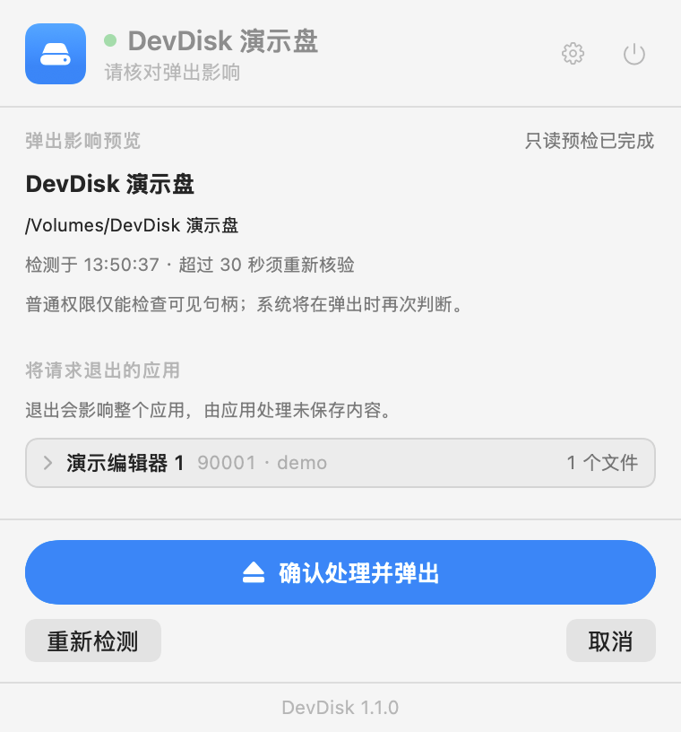

<p align="center">
  
</p>

<h1 align="center">DevDisk</h1>

<p align="center">
  <strong>English</strong> · <a href="README.zh-CN.md">简体中文</a>
</p>

<p align="center">
  <strong>Can't eject your external dev drive? DevDisk shows what's still using it, then ejects it safely.</strong><br>
  A small macOS menu bar app for developers who keep Android SDKs, Gradle caches, or Xcode projects on an external drive.
</p>

<p align="center">
  <a href="https://github.com/fengfe1125/devdisk/releases/latest"></a>
  
  
  <a href="LICENSE"></a>
</p>

<p align="center">
  <a href="https://github.com/fengfe1125/devdisk/releases/latest"><strong>Download the latest release</strong></a>
</p>

## The problem

If your development setup lives on an external drive, this probably sounds familiar:

- **You click Eject, and macOS says no.** The disk is in use, but it's not obvious by what. The culprit is usually a background process — a Gradle or Kotlin daemon, or adb — still running long after you closed Android Studio. In Activity Monitor they show up as `java` or `adb`, so you'd never guess.
- **So you force it, or pull the cable.** Everything looks fine. Then your next build fails with a strange error, because a cache file was cut off halfway through being written. It looks like a bug in your code, and you can waste a long time chasing it.
- **Checking on the drive means a pile of Terminal commands.** How much space is left and what's using it, whether the drive is healthy, whether Time Machine or Spotlight is touching it.

## What DevDisk does

- **Shows the drive's status in your menu bar:** connected, needs attention, ejecting, or safe to unplug.
- **Finds what's using the drive.** It lists the programs holding files on it, split into ones it can close for you and ones you'll need to close yourself.
- **Ejects safely, in the right order.** After you confirm, it asks apps like Xcode and Android Studio to quit normally (they still ask you to save your work), stops the Gradle and Kotlin daemons and adb, ejects the drive, and checks that the drive is really gone before telling you it's safe to unplug.
- **Gives the drive a checkup:** free space and what's taking it up, drive health (life left, temperature, unexpected power losses), encryption, and whether Time Machine, Spotlight, or disk sleep settings could cause trouble.
- **Warns you about a common trap.** While the drive is unplugged, it reminds you not to open Android Studio — it may think your SDK is missing and download the whole thing again onto your Mac's internal disk.

<p align="center">
  
  <br>
  <sub>Before ejecting, DevDisk shows what it will close and waits for you to confirm. Demo data; the app's interface is in Chinese.</sub>
</p>

## What it will never do

- Force-quit your apps or services, or force-eject the drive.
- Close something just because its name matches. It only acts on a program it can see holding files on this drive.
- Tell you "nobody is using it" or "safe to unplug" without checking. If a check fails or times out, it tells you.
- Touch system processes or other users' processes.
- Ask for admin rights. When a system setting needs changing, it gives you a command to copy instead of running it for you.

Simulators, builds that are still running, and anything it can't identify are left alone. DevDisk asks you to deal with them first.

## Language

Choose **Follow System**, **简体中文**, or **English** at the top of the panel settings or in the settings window (⌘,) under **General**. Changes apply immediately across open windows and are saved for next time. Follow System uses Simplified Chinese when your preferred system language is Chinese, and English otherwise. macOS controls the language of system permission dialogs.

## Install

1. Download the zip from the [latest release](https://github.com/fengfe1125/devdisk/releases/latest) and unzip it.
2. Drag `DevDisk.app` into your Applications folder.
3. The first time you open it, macOS may block it, because the app isn't notarized by Apple. Go to **System Settings → Privacy & Security** and click **Open Anyway**.

For more detailed drive health (life left, temperature, power-on hours), you can also install smartmontools. DevDisk works without it and tells you what's missing.

```bash
brew install smartmontools
```

**Requirements:** macOS 14 or later on a Mac with Apple silicon. The app's interface is currently in Chinese.

## Build from source

```bash
swift test
./package.sh -    # builds build/DevDisk.app without installing it
```

## More details

- [How DevDisk works](docs/how-it-works.md): the exact eject steps, what it can and can't detect, and how to test it.
- [1.1.0 validation record](docs/validation-1.1.0.md) (in Chinese)

## License

[MIT](LICENSE)
